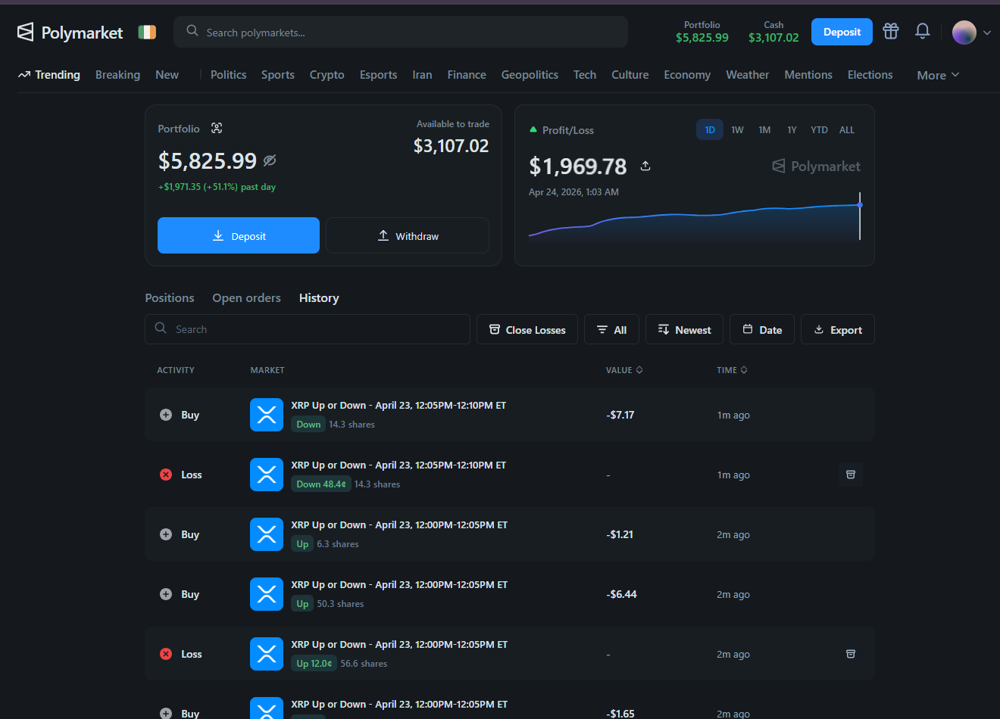
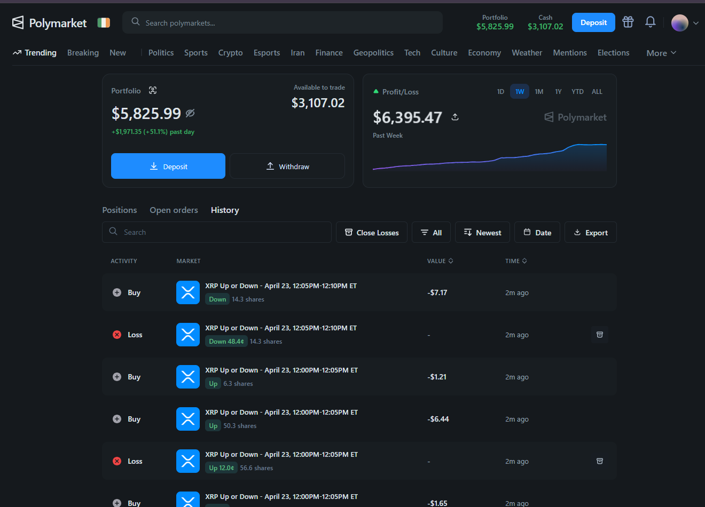
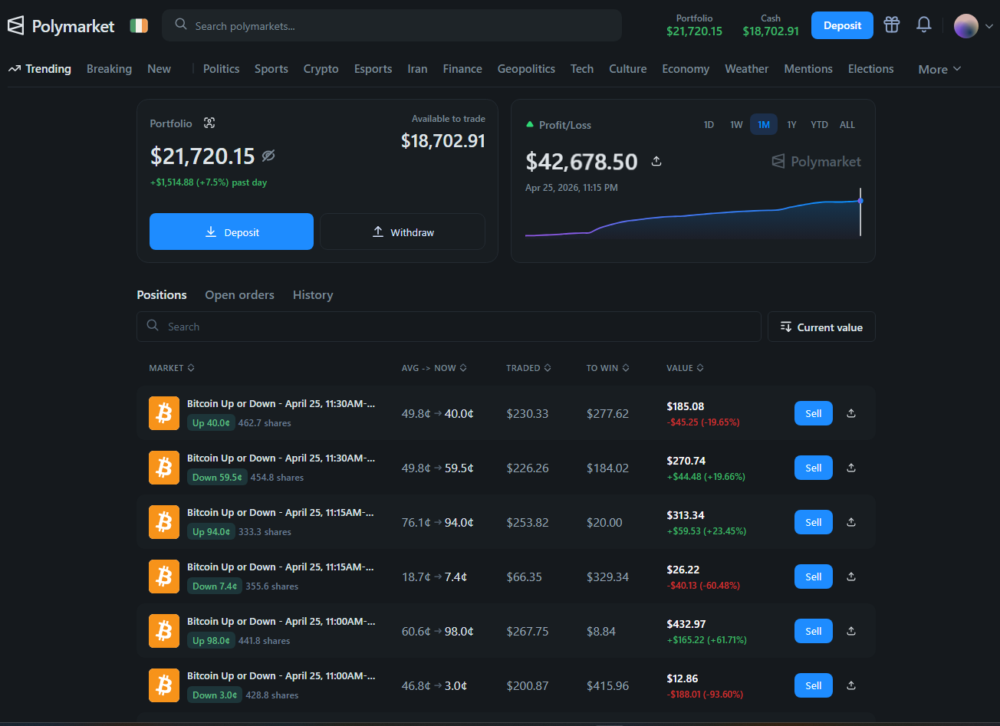

<div align="center">

# Polymarket BTC Up/Down Trading Bot

### BTC 5m Up/Down · CLOB arbitrage · copy-trading · Polygon

A production-oriented **Node.js** trading bot for **Polymarket** short-duration **Up/Down** markets on **Polygon**, with both **arbitrage** and **copy-trading** workflows.

<p>
  <a href="https://github.com/BlackCandleLab/polymarket-trading-bot"><b>GitHub · BlackCandleLab/polymarket-trading-bot</b></a>
  &nbsp;·&nbsp;
  <a href="https://polymarket.com"><b>Polymarket.com</b></a>
</p>

[](https://nodejs.org/)
[](https://polymarket.com)
[](https://github.com/BlackCandleLab/polymarket-trading-bot)

</div>

<sub>

**Keywords:** polymarket copy trading bot polymarket arbitrage bot, polymarket copy trading bot polymarket arbitrage bot, polymarket copy trading bot polymarket arbitrage bot, polymarket copy trading bot polymarket arbitrage bot, polymarket copy trading bot polymarket arbitrage bot, polymarket copy trading bot polymarket  bot,

</sub>

---

### Contents

- [Beyond simple arbitrage (2026)](#beyond-simple-arbitrage-2026)
- [Four strategies bots profit from](#four-strategies-bots-profit-from)
- [How this bot maps to those strategies](#how-this-bot-maps-to-those-strategies)
- [Execution and risk management](#execution-and-risk-management)
- [Why this repository](#why-this-repository)
- [Overview](#overview)
- [Screenshots](#screenshots)
- [Detailed Runbook](#detailed-runbook)
- [Key Features](#key-features)
- [Repository Modes](#repository-modes)
- [Strategy Summary](#strategy-summary)
- [Requirements](#requirements)
- [Installation](#installation)
- [Configuration](#configuration)
- [Quick Start](#quick-start)
- [Logging and Output](#logging-and-output)
- [Project Structure](#project-structure)
- [File Guide](#file-guide)
- [Practical Safety Notes](#practical-safety-notes)
- [Troubleshooting](#troubleshooting)
- [Recommended First Run](#recommended-first-run)
- [Disclaimer](#disclaimer)

---

## Beyond simple arbitrage (2026)

The classic Polymarket playbook — *buy YES and NO when their combined price is below $1.00 and collect the spread* — was real in 2024. By 2026, that edge is largely captured by sub-100ms bots on dedicated Polygon RPC nodes. Orderbook analysis from Q3 2025 through Q1 2026 suggests:

| Metric | Trend |
| --- | --- |
| Average arb opportunity duration | ~2.7s (down from ~12.3s in 2024) |
| Arb profits captured by sub-100ms bots | ~73% |
| Median arb spread | ~0.3% (often thin after gas) |
| Bot profits from **non-arb** strategies | ~27% |

Profitable automation in 2026 is less about chasing microsecond YES+NO spreads and more about **multi-strategy portfolios**: market making, information-speed edges, logical correlation plays, and short-window momentum — with disciplined execution and risk caps.

This README incorporates that framework from [Beyond Simple Arbitrage: 4 Polymarket Strategies Bots Actually Profit From in 2026](https://medium.com/illumination/beyond-simple-arbitrage-4-polymarket-strategies-bots-actually-profit-from-in-2026-ddacc92c5b4f) (Jemy Rose, ILLUMINATION, Feb 2026) and maps it to what **this repository** actually runs.

> **Disclaimer:** Past market statistics and backtests in the article do not guarantee future results. This software is educational/operational tooling, not financial advice.

---

## Four strategies bots profit from

### 1. Automated market making

**Profile:** ~78–85% win rate · low volatility · ~1–3% monthly (article benchmarks)

Instead of betting on an outcome, the bot posts liquidity on **both** sides and earns the bid–ask spread. That requires continuous orderbook monitoring, inventory limits, spread widening on volatility, and pulling quotes before major news — work that is impractical manually but feasible for a 24/7 bot.

### 2. AI-powered probability arbitrage

**Profile:** ~65–75% win rate · medium volatility · ~3–8% monthly

When news or data moves fair probability faster than the CLOB reprices, there is a short window (seconds to minutes) to trade the gap. Ensemble models (LLMs + fine-tuned models) can ingest headlines and update Bayesian-style estimates faster than discretionary traders — **this repo does not ship LLM/news APIs**; see [extension points](#how-this-bot-maps-to-those-strategies) if you want to build that layer.

### 3. Correlation and logical arbitrage

**Profile:** ~70–80% win rate · low–medium volatility · ~2–5% monthly

Exploit **impossible or inconsistent** prices across related markets (e.g. “Team X wins” vs “Conference Y wins”, or outcome probabilities that sum above 100%). Requires graph-style relationship mapping and multi-leg execution within a tight window — **not implemented** in this codebase today.

### 4. High-frequency momentum / latency (BTC 5-minute markets)

**Profile:** ~60–70% win rate · high volatility · ~8–15% monthly (aggressive profiles)

On short Up/Down windows, price can lag oracle or orderbook reality for seconds. Bots that monitor Chainlink/oracle feeds and the CLOB WebSocket can act before the UI catches up. **This is the primary focus of the main arbitrage engine** (`btc-updown-5m-*`).

### Multi-strategy portfolios (article takeaway)

Professional setups rarely rely on one mode. Typical allocations described in the article:

| Profile | Mix (illustrative) | Role of simple arb |
| --- | --- | --- |
| Conservative | ~80% arb/MM, ~20% market making | Ballast — market-neutral, steady |
| Balanced | ~50% arb, ~30% AI/signals, ~20% MM | Growth with measured risk |
| Aggressive | ~30% arb, ~50% AI/momentum, ~20% MM | Returns driver; higher drawdown |

Even “aggressive” portfolios keep some market-neutral arb/MM to smooth returns. **This repo** gives you **Strategy 1 (partial)** via dual-sided ladders, **Strategy 4** via the 5m BTC engine, and **copy-trading** as a separate social-signal path — not a full four-strategy stack out of the box.

---

## How this bot maps to those strategies

| Strategy | In this repo? | Where |
| --- | --- | --- |
| Market making (dual-sided liquidity) | **Partial** | Symmetric buy ladders on Up and Down; merge when paired (`src/trader.js`) |
| AI probability arbitrage | **No** | Would need news/LLM pipelines (not in `package.json`) |
| Correlation / logical arb | **No** | Single-market 5m focus; no cross-market graph |
| Momentum / latency (5m BTC) | **Yes (core)** | WebSocket orderbook, taker arb when `bestAskUp + bestAskDown < 1 - TARGET_EDGE`, oracle-aware resolution flow |
| Copy-trading (information follow) | **Yes** | `src/copy-trader.js`, `src/copy/` — mirror target wallet buys |
| Simple YES+NO arb | **Yes (component)** | Paired taker buys + merge/redeem; compete with HFT — use private RPC and tight risk caps |

#### Extension points (not included today)

- Cross-platform arb (Polymarket vs Kalshi, etc.)
- Automated correlation graph across 100+ markets
- Built-in news/LLM ensemble signals
- Telegram or managed “platform” orchestration

Those are extension points if you fork and combine this runtime with external signal services.

---

## Execution and risk management

The article argues **strategy is ~30% of success; execution and risk are ~70%**. This bot aligns with that stack:

| Concern | Implementation here |
| --- | --- |
| Fast execution | CLOB WebSocket + REST fallback (`src/clob.js`); dedicated `POLYGON_RPC` recommended |
| Partial fills / liquidity | `MAX_TAKER_FILL_USDC`, ladder sizing, merge thresholds |
| Position limits | `MAX_SPEND_PER_MARKET`, `MAX_INVENTORY_IMBALANCE_USDC` |
| Circuit breakers | `MAX_LOSS_PER_HOUR_USDC`, `COMBINED_ASK_STOP` |
| Stop adding risk near close | `STOP_BUYING_BEFORE_CLOSE` |
| Copy-trade caps | `COPY_MAX_*`, slippage and stale-trade filters |
| Credential resilience | Auto L1→L2 CLOB credential derive/refresh in `src/clob.js` |

**Infrastructure the article recommends (and this repo expects):**

- Node 18+, reliable Polygon RPC (Alchemy/Infura-class, not only public endpoints)
- USDC + MATIC on Polygon, Polymarket proxy wallet configured correctly
- 24/7 process if you want continuous 5m windows; graceful shutdown on `SIGINT` / `SIGTERM`

Manual browser trading against sub-100ms automation is a structural disadvantage; this project is the **DIY / open-source** path (full control, you own ops and maintenance).

---

## Why this repository

This project is built for users who need an operational trading runtime instead of a toy script:

- Real CLOB authentication and order execution on Polymarket
- On-chain approvals, merge, and redeem transaction flows
- Real-time order-book monitoring via WebSocket with fallback logic
- Configurable risk limits, circuit breakers, and graceful shutdown behavior
- Dedicated copy-trading path for mirroring selected wallet activity

This repository contains:

- A **5-minute BTC Up/Down arbitrage bot** that posts both sides of the market, takes mispriced liquidity, merges matched pairs, and redeems after resolution.
- An **integrated wallet-following module** that can mirror future buys from a target wallet during the main runtime.
- A **dedicated buy-only copy trader** under `src/copy/` that polls Polymarket's public trade feed and reacts to fresh target-wallet buys.

The codebase is structured for real trading: on-chain approvals, Polymarket CLOB authentication, WebSocket order-book tracking, risk caps, circuit breakers, structured logging, and graceful shutdown handling are all included.

> Important: This software places live blockchain and market orders. Use it only if you fully understand the strategy, the wallet setup, the gas implications, and the market risks.

## Overview

This bot is designed around **Polymarket complementary-token markets**, especially the recurring `btc-updown-5m-*` markets.

At a high level, the main arbitrage engine:

1. Loads your signer and Polymarket proxy wallet configuration.
2. Ensures the required Polygon approvals are in place.
3. Derives or refreshes Polymarket CLOB API credentials automatically.
4. Discovers the next 5-minute BTC Up/Down market before it opens.
5. Posts a symmetric buy ladder on both `Up` and `Down`.
6. Aggressively buys both sides when the combined ask becomes favorable.
7. Merges matched pairs back into USDC when economically sensible.
8. Cancels open orders at market close.
9. Waits for resolution and redeems winning positions.

The repository also supports copy-trading workflows for users who want to follow a target Polymarket wallet with configurable sizing and risk caps.

## Screenshots

The following screenshots show the workflow this bot targets.

### Performance







### Activity Snapshot


## Detailed Runbook

1. Install dependencies:

```bash
npm install
```

2. Create your local environment file:

```powershell
Copy-Item .env.example .env
```

or:

```bash
cp .env.example .env
```

3. Configure at minimum:
- `PRIVATE_KEY`
- `PROXY_WALLET`
- `POLYGON_RPC` (strongly recommended)

4. Start with conservative limits and run:

```bash
npm start
```

## Key Features

- **Dual-sided ladder execution** for recurring BTC 5-minute markets.
- **Taker arbitrage logic** when combined best ask drops below the configured edge threshold.
- **On-chain merge and redeem support** for Polymarket negative-risk markets.
- **Session and per-market risk controls** including spend caps and circuit breakers.
- **Automatic CLOB credential derivation** through Polymarket's documented L1-to-L2 auth flow.
- **Live WebSocket order-book tracking** for low-latency price updates.
- **Optional wallet mirroring** for follow-trading workflows.
- **Dedicated copy-trading engine** with filters for stale trades, price bounds, slippage, and cumulative spend.
- **Structured console and file logging** through `winston`.
- **Graceful shutdown** on `SIGINT` / `SIGTERM`.

## Repository Modes

There are two primary ways to use this repository.

### 1. Main Arbitrage Engine

The main runtime lives in `src/index.js`.

It is focused on:

- Discovering the next `btc-updown-5m` market
- Posting both-sided ladders at the open
- Executing taker arb when the market offers enough edge
- Merging matched pairs back into USDC
- Redeeming after oracle resolution

This is the core strategy described by the main `package.json` metadata.

### 2. Copy-Trading Workflows

The repo currently contains **two copy-related paths**:

- **Integrated copy watcher** in `src/copy-trader.js`  
  If `TARGET_WALLET` is set, the main runtime snapshots that wallet's current positions and then mirrors future increases in `totalBought`.

- **Dedicated buy-only copy trader** in `src/copy/`  
  This path uses `src/copy/activityFeed.js` plus `src/copy/copyTrader.js` to detect fresh public trade activity from one or more target wallets and submit capped buy orders quickly.

If your goal is to use the dedicated copy system, read the copy-trading section below carefully and prefer the explicit `src/copy/index.js` entrypoint.

## Strategy Summary

In the [2026 multi-strategy framing](#four-strategies-bots-profit-from), the main engine is closest to **high-frequency momentum / latency on BTC 5-minute Up/Down markets**, with **market-making-style** dual-sided ladders and **simple complementary-token arb** when the combined ask offers edge.

### Main Arb Logic

The core `Trader` class in `src/trader.js` implements a market lifecycle roughly like this:

1. **Wait for market open**  
   The bot discovers the next market before open, then waits until the trading window is live.

2. **Post the ladder**  
   It places buy orders across many configured price levels on both outcomes.

3. **Monitor live best asks**  
   A WebSocket feed keeps the current top-of-book available with REST fallback when needed.

4. **Fire taker arb orders**  
   When `bestAskUp + bestAskDown < 1 - TARGET_EDGE`, the bot submits paired buy orders.

5. **Merge matched pairs**  
   If both outcomes have been accumulated in sufficient size, the bot merges them back into USDC.

6. **Stop buying near market close**  
   It stops adding risk before the window ends, then cancels remaining open orders.

7. **Wait for resolution and redeem**  
   After the market resolves, the bot redeems any winning positions.

### Built-In Risk Controls

The main strategy includes multiple safety mechanisms:

- `MAX_SPEND_PER_MARKET`
- `MAX_TAKER_FILL_USDC`
- `MAX_INVENTORY_IMBALANCE_USDC`
- `COMBINED_ASK_STOP`
- `MAX_LOSS_PER_HOUR_USDC`
- `STOP_BUYING_BEFORE_CLOSE`
- `MERGE_THRESHOLD_USDC`

These controls are not optional decoration. They define how aggressively the bot is allowed to trade and when it must stop.

## Requirements

Before running the bot, make sure you have:

- **Node.js 18+**
- A **Polymarket account**
- Your **Polygon EOA private key**
- Your **Polymarket proxy wallet address**
- **USDC on Polygon**
- Enough native MATIC for gas
- Access to a reliable Polygon RPC endpoint

Recommended:

- Use a dedicated wallet for bot operation
- Start with small size caps
- Use a private RPC provider instead of the default public endpoint
- Test copy workflows with `COPY_DRY_RUN=true` first

## Installation

Clone this repository (canonical URL):

```bash
git clone https://github.com/BlackCandleLab/polymarket-trading-bot.git
cd polymarket-trading-bot
```

Then install dependencies:

```bash
npm install
```

The repo already includes a `package-lock.json`, so a normal `npm install` is the intended setup path.

## Configuration

Copy the example environment file.

PowerShell:

```powershell
Copy-Item .env.example .env
```

Bash:

```bash
cp .env.example .env
```

Then edit `.env` with your real wallet and risk settings.

### Minimum Required Settings

These values are essential for almost every real run:

| Variable | Required | Purpose |
| --- | --- | --- |
| `PRIVATE_KEY` | Yes | Your Polygon signer used for approvals and order signing |
| `PROXY_WALLET` | Yes | The Polymarket proxy wallet tied to your account |
| `POLYGON_RPC` | Strongly recommended | Polygon RPC endpoint used by `ethers` |
| `LOG_LEVEL` | No | Console/file logging verbosity |

### Main Arbitrage Settings

These parameters shape the main strategy:

| Variable | What it controls |
| --- | --- |
| `MAX_SPEND_PER_MARKET` | Total buy-side budget for one 5-minute market |
| `TARGET_EDGE` | Minimum combined-price edge before firing arb buys |
| `MERGE_THRESHOLD_USDC` | Minimum matched pair size before merge |
| `MAX_TAKER_FILL_USDC` | Maximum size for a single taker action |
| `MAX_INVENTORY_IMBALANCE_USDC` | Inventory imbalance guardrail |
| `COMBINED_ASK_STOP` | Hard stop if the market becomes too expensive |
| `MAX_LOSS_PER_HOUR_USDC` | Rolling session loss circuit breaker |
| `LADDER_LEVELS` | Ladder prices posted on both sides |
| `LADDER_SIZE_PER_LEVEL_USDC` | Size allocated to each ladder level |

### Copy-Trading Settings

The repo exposes two different copy-trading parameter groups.

#### Integrated Copy Watcher

| Variable | Purpose |
| --- | --- |
| `TARGET_WALLET` | Single target Polymarket wallet to mirror during main runtime |
| `COPY_TRADE_BUY_PERCENT` | Percent of target spend to mirror |
| `COPY_TRADE_POLL_MS` | Poll interval for the target positions API |

#### Dedicated Buy-Only Copy Trader

| Variable | Purpose |
| --- | --- |
| `COPY_TARGETS` | Comma-separated list of target wallets |
| `COPY_SIZE_MODE` | `FIXED`, `MIRROR`, or `RATIO` |
| `COPY_FIXED_USDC` | Fixed spend per copied trade |
| `COPY_RATIO` | Spend multiplier when `COPY_SIZE_MODE=RATIO` |
| `COPY_MAX_USDC_PER_TRADE` | Hard cap per copied trade |
| `COPY_MAX_USDC_PER_MARKET` | Hard cap per market |
| `COPY_MAX_USDC_PER_HOUR` | Rolling hourly cap |
| `COPY_MAX_USDC_TOTAL` | Session-wide cap |
| `COPY_MAX_SLIPPAGE` | Maximum price premium above target fill |
| `COPY_MAX_PRICE` | Upper price filter |
| `COPY_MIN_PRICE` | Lower price filter |
| `COPY_STALE_MS` | Reject stale signals |
| `COPY_POLL_MS` | Poll frequency for target trades |
| `COPY_ALLOWED_CONDITIONS` | Optional allow-list |
| `COPY_BLOCKED_CONDITIONS` | Optional block-list |
| `COPY_DRY_RUN` | Log-only mode without real orders |

### CLOB Credentials

The example file includes:

- `POLY_API_KEY`
- `POLY_API_SECRET`
- `POLY_API_PASSPHRASE`

These can be left blank on first run. The client in `src/clob.js` attempts to derive valid credentials automatically from your signer. If cached credentials become invalid, the client also attempts a refresh flow.

## Quick Start

### Main Arbitrage Bot

1. Install dependencies with `npm install`.
2. Copy `.env.example` to `.env`.
3. Fill in `PRIVATE_KEY`, `PROXY_WALLET`, and a reliable `POLYGON_RPC`.
4. Start with conservative values such as a smaller `MAX_SPEND_PER_MARKET`.
5. Run the bot.

```bash
npm start
```

You can also run the explicit arb script:

```bash
npm run arb
```

For development mode with Node's file watcher:

```bash
npm run dev
```

or

```bash
npm run arb:dev
```

### Integrated Wallet Mirroring

If you want the main runtime to also mirror future buys from a specific target wallet:

1. Set `TARGET_WALLET` in `.env`.
2. Optionally tune `COPY_TRADE_BUY_PERCENT` and `COPY_TRADE_POLL_MS`.
3. Launch the main bot as normal.

The bot will snapshot existing positions first, then only react to **new buy increases** observed after startup.

### Dedicated Buy-Only Copy Trader

If you want the dedicated `src/copy/` implementation:

1. Configure `COPY_TARGETS`.
2. Set conservative caps.
3. Prefer starting with `COPY_DRY_RUN=true`.
4. Run the dedicated entrypoint directly.

```bash
node src/copy/index.js
```

This path is useful when your focus is low-latency buy-following rather than the BTC 5-minute arbitrage lifecycle.

## Logging and Output

The logger writes:

- Colored structured logs to the console
- JSON logs to `bot.log`

This is useful for:

- Live monitoring
- Post-session debugging
- Reviewing order failures
- Investigating market timing and slippage

## Project Structure

```text
.
|-- .env.example
|-- package.json
|-- img/
|-- src/
|   |-- index.js
|   |-- trader.js
|   |-- copy-trader.js
|   |-- market.js
|   |-- clob.js
|   |-- onchain.js
|   |-- pnl.js
|   |-- logger.js
|   `-- copy/
|       |-- index.js
|       |-- activityFeed.js
|       |-- copyTrader.js
|       `-- config.js
`-- README.md
```

## File Guide

- `src/index.js`  
  Main bot lifecycle, startup, market loop, graceful shutdown, and optional integrated copy watcher.

- `src/trader.js`  
  Per-market state machine for ladder posting, taker arb, merge logic, order cancellation, and redeem flow.

- `src/market.js`  
  Polymarket Gamma/Data API helpers for market discovery, wallet positions, and resolution polling.

- `src/clob.js`  
  CLOB REST and WebSocket client, auth handling, order signing, and order posting utilities.

- `src/onchain.js`  
  Polygon approvals, token balances, merge transactions, and redeem transactions.

- `src/copy-trader.js`  
  Integrated target-wallet mirroring based on changes in target positions.

- `src/copy/activityFeed.js`  
  High-frequency polling of public trade data for specific wallets.

- `src/copy/copyTrader.js`  
  Dedicated copy-trading execution engine with filters and spend accounting.

## Practical Safety Notes

- Do **not** start with large sizing.
- Do **not** run with a wallet you use for unrelated funds.
- Do **not** assume public RPC endpoints are stable enough for serious production usage.
- Do **not** skip reading the `.env.example` comments; they explain the intended meaning of most controls.
- Do start with `COPY_DRY_RUN=true` for copy trading.
- Do verify your proxy wallet address carefully.
- Do keep enough MATIC available for approvals, merges, and redeems.

## Troubleshooting

### The bot exits immediately with a missing env var error

Check `.env` and confirm the required fields are actually populated:

- `PRIVATE_KEY`
- `PROXY_WALLET`

For dedicated copy trading, also confirm:

- `COPY_TARGETS`

### Orders fail or the bot cannot authenticate

- Confirm your signer matches the intended Polymarket account.
- Confirm `PROXY_WALLET` is the correct proxy wallet for that signer.
- Try a stable private Polygon RPC endpoint.
- Leave `POLY_API_*` blank if you want the bot to derive fresh credentials automatically.

### Copy trades are not firing

- Make sure your target wallet address is lowercased correctly in the copy settings.
- Check that the target is placing fresh **BUY** trades, not only sells or old fills.
- Verify your caps are not too restrictive.
- For dedicated copy mode, make sure `COPY_DRY_RUN` is set the way you expect.

### Merge or redeem transactions fail

- Confirm approvals were granted successfully.
- Confirm you hold enough matched positions to merge.
- Confirm the market is actually resolved before expecting redeem payout.
- Check `bot.log` for the underlying error payload.

## Recommended First Run

If you are launching this repo for the first time, the safest path is:

1. Fill `.env` with real wallet values.
2. Use a private RPC endpoint.
3. Lower your spend caps materially.
4. Run the main bot in observation mode with small sizing.
5. If testing copy logic, enable `COPY_DRY_RUN=true` first.
6. Review `bot.log` after a short session before scaling up.

## Disclaimer

This repository is provided for research and operational use by experienced users. It is **not financial advice**, and it does not guarantee profit. Real-money trading on Polymarket and Polygon involves market risk, execution risk, smart contract risk, RPC reliability risk, and operational risk. You are fully responsible for how you configure and use this software.

Strategic context in this README is adapted from [Beyond Simple Arbitrage: 4 Polymarket Strategies Bots Actually Profit From in 2026](https://medium.com/illumination/beyond-simple-arbitrage-4-polymarket-strategies-bots-actually-profit-from-in-2026-ddacc92c5b4f). That article’s performance figures and product references (e.g. third-party managed bots) are **not** endorsements by this project — verify all claims independently before risking capital.
